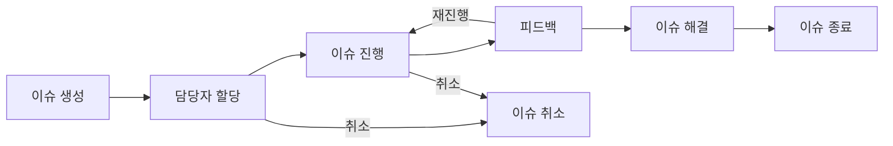

개발 도구

통합 개발 환경 IDE
구성품 : 인터프리터, 디버거, 에디터 (일반적으로 기본)

VSC, 이클립스같은 IDE부터 깃헙, 레드마인, 젠킨스 등 다양한 도구를 사양하게 될 것임. 이런 도구에 대한 이해는 중요하다.

# 6.1 개발 도구

에디터
단순 코드 편집 뿐 아니라, 리팩터링과 같은 SW 개발 방법론을 지원한다.
다양한 플러그인을 통한 확장기능 지원

이클립스 / 인텔리제이
개발자들이 많이 사용하는 자바 개발 도구
이클립스는 기본 기능이 많지 않아 플러그인으로 커스텀 필요
인텔리제이는 이클립스에 비해 전반적으로 우수한 기능 제공, 워크스페이스 개념이 없어 두 프로젝트 비교 시 인텔리제이를 하나 더 실행해줘야 한다. 또한 유료이다.

VSC
대부분의 언어 지원 및 Extensions라는 확장 기능 설치를 통해 다양한 언어를 위한 개발도구 사용 가능.
그리고 가볍고 무료다.
책에서는 다양한 언어를 위해 사용한다고 했는데, 인텔리제이도 가능하다.

안드로이드 스튜디오, 엑스코드
모바일 앱 개발 시 사용된다.

개발 환경
안드로이드 스튜디오
안드로이드 OS 구동 앱에 사용, 자바 / 코틀린
에뮬레이터 제공

엑스코드
iOS 구동 앱에 사용, Swift / Object-C
시뮬레이터를 통해 개발한 앱 테스트 가능.
해당 도구 이용 시 앱 배포할 때 개발자 등록(유료) 필요.
macOS에서만 사용 가능.

# 6.2 형상관리

깃허브
소스코드 충돌 같은 난감한 상황 해결하기 쉬워진다. 정확히는 깃이 그걸 해주고 깃허브는 깃의 확장이라 봐야하지 않나?

형상
소스 코드 모양을 뜻한다. 책에서도 추상적으로 설명했다.
형상 관리에 대해 이런 소프트웨어 형상을 관리하여 고쳤던 에러가 재발하거나 잘못된 버전을 배포하는 것을 관리한다... 정도로 설명했다.

형상 관리 도구가 왜 필요한가
- 손쉬운 소스 코드 통합
- 사용자 인증 과정을 거치는 과정으로 기술 유출 방지

책에서 CVS, SVN을 오래된 기술처럼 말하는데 실제로 SVN은 실무에서도 많이 보인다고 함... 그리고 깃헙보단 GitLab 쓰는 것으로 알고있다...!

깃 이론에 것과 Git-flow 전략에 대한 설명을 한다.
초심자 기준이라 아주 쉽게 설명해서 생략한다.

# 6.3 이슈 관리, 레드마인

이슈도 관리가 필요하다.

*이슈 워크플로*

1. 이슈생성 (new)
이슈 생성은 이슈 발견한 사람에 의해 수행되지만, 반드시 이 사람이 수행할 필요는 없다.
2. 담당자 할당 (assigned)
담당자를 할당한다. 이슈가 아니라고 판단될 시 취소 가능
3. 이슈 진행 (in progress)
할당된 이슈는 처리되어야 한다. 이 단계에서도 취소 가능
4. 피드백 (feedback)
이슈 제기자로부터 피드백을 받는다. 이슈가 제대로 처리되지 않았다고 판단되면 이전 상태로 되돌아간다.
5. 이슈 해결 (resolved)
이슈가 해결되었다고 판단되면 해당 상태로 넘어간다.
6. 이슈 종료 (closed)
이슈 해결 후 이슈를 닫는다.

[해결과 종료에는 어떤 차이점이 있는가?](https://community.atlassian.com/forums/Jira-Service-Management/what-is-the-difference-between-closed-and-resolved-status/qaq-p/882590)
[참고자료2](https://nulab.com/learn/software-development/resolved-vs-closed-whats-difference/)

resolved는 다시 열릴 수 있고, closed는 다시 열릴 수 없다는 차이점이 있다고 설명하고 있음.
또한 resolved는 개발자가 정상적으로 고쳤음을 의미하며, closed는 이해관계자 (QA 또는 팀 멤버 등)가 완전히 고쳐졌다. 라고도 표현함.
모두 조금씩 다른 데, closed는 assigner 뿐만 아니라 다른 팀 멤버들도 승인한 상태라는 것으로 보인다.
closed만 사용하는 룰을 적용하는 팀도 있다.
결국... 팀에 따라 다르다!

### 레드마인 소개

이슈 관리 방법 중 하나로 레드마인이 있다.
지라와 거의 동일한 기능을 제공하면서 무료이다.
이슈 상태 변경 및 다양한 기능을 이용한 이슈 종류와 심각도 설정 기능 등 존재

도구를 소개하는 김에 이슈 관리 방법 또한 소개한다.

다음과 같은 기준에 따라 이슈 유형을 설정함

| 이슈 유형 (예시) | 용도               |
| ---------- | ---------------- |
| Bug        | 결함 수정을 위한 이슈     |
| Feature    | 새로운 기능 추가를 위한 이슈 |
| Task       | 태스크 규모의 단기 이슈    |
| Project    | 프로젝트 규모의 장기 이슈   |
이슈 유형만으로는 이슈를 수행할 수 없다. 모든 이슈를 한꺼번에 처리하기에는 인적 자원이 한정되어 있기 때문이다. 따라서 우선순위가 추가된다.

| 우선순위 (예시) | 이슈 내용                         | 예시                                |
| --------- | ----------------------------- | --------------------------------- |
| Immediate | 즉시 처리해야 하는 매우 긴급한 이슈          | 프로그램 비정상 종료, 데이터 유실            |
| Urgent    | 긴급하게 처리해야 하는 이슈               | 중요 기능 결함, 심각한 성능 저하, 보안 취약점 |
| High      | 우선적 처리해야 하는 이슈                | 일반 기능 결함, 성능 개선                |
| Normal    | 조만간 처리해야 하는 이슈                | 마이거 기능 결함, 사용성 개선              |
| Low       | 당장 수정 필요X, 언젠가 수정해야 하는 사소한 이슈 | 메시지 수정, 레이아웃 변경                |
보통은 이 정도를 사용한다고 한다.
우선순위 선정에도 규칙이 존재한다.
재현 빈도와 영향도의 곱으로 표현된다.
재현 빈도는 이슈가 얼마나 자주 발생하는지를 나타내고, 영향도는 이슈가 미칠 영향의 정도를 뜻한다.

재현 빈도와 영향도 모두 높음/중간/낮음 정도로 분류할 수 있다. 물론 이것도 절대적인 것은 아님. 위험 기반 접근법에서 종종 접하게 되니 우선순위 결정 시 참고할 수 있다.

이런 식으로 이슈 관리가 필요하다!

# 6.4 지속적 통합, 젠킨스

여러 개발자가 협업을 통해 하나의 시스템을 완성하려면 통합 과정이 요구됨.
통합은 쉬운 과정이 아니다. 두 함수의 인터페이스가 맞지 않거나, 반환 값이 잘못되거나...
통합 과정에서도 이슈는 존재한다!

빌드, 테스트, 배포 과정은 일반적으로 개발자가 리포지토리에 소스 코드를 반영하고, 품질 관리자가 빌드 및 테스트를 하며 배포 관리자가 배포한다.

공통 모듈 또는 함수를 누군가 임의로 수정할 시 이 코드가 업로드되면 정상적으로 동자갛지 않을 수 있다. 이런 식의 통합은 혼란을 주기 때문에 별도 테스트 조직 또는 개발 조직 담당자가 주도하여 주기적으로 소스코드를 통합하고, 이를 빌드해 테스트를 수행한다.

빌드와 테스트의 모든 작업을 도구를 사용하지 않고 수작업으로 수행하는 경우도 문제가 있다.

예시
소스 코드 통합과 테스트 등의 과정을 하루 한 번만 수행한다고 가정 시, 이슈 발생부터 테스트 완료까지 길게는 하루가 걸린다. 빌드, 단위, 통합 테스트 등 다양한 테스트를 순차적으로 수행한다는 점을 고려 시 이슈를 리포팅하는 데 더 많은 시간이 걸릴 것이다.

에러 발생 시점부터 수정 및 통합, 이를 테스트 하는 데 며칠이 걸린다면 통합이 매우 비효율적으로 이루어지는 것이다!
이런 탓에 CI/CD를 고민하게 된다.
CI/CD는 소스코드 통합, 빌드, 테스트, 배포 등을 자동화하여 지속적으로 통합하고 즉시 배포하는 방법이다. 이를 위해 사용하는 도구가 젠킨스이다.

젠킨스는 빌드, 테스트, 배포 등을 자동화하며 웹 기반으로 제공되기 때문에 접근성이 용이하고 실행 현황을 대시보드를 통ㅎ 모니터링할 수 있다.

깃허브와 젠킨스를 활용한 CI/CD 파이프라인 예시
1. 개발자의 코드를 깃 허브에 반영(체크인)
2. 젠킨스는 반영된 소스 코드를 체크아웃 해 빌드 수행
3. 빌드 정상 수행된 경우, 단위, 기능, 성능, 보안성 등 테스트 수행
4. 테스트가 에러 없이 통과된 경우 애플리케이션 배포 수행

빌드 먼저 수행하는 이유?
개발자가 코드를 잘못 수정해 빌드되지 않은 상태가 있는지 확인하기 위함.
빌드 깨진 경우 해당 빌드 깨트린 개발자에게 빠르게 알려준다. 또한 모든 개발자에게 해당 빌드를 다운로드하지 않게 하여 혼란을 최소화한다.

자동화된 테스트 단계
젠킨스는 테스트를 동시 수행할 수 있어 테스트 시간 단축한다.
단위, 기능, 성능, 보안성 테스트를 순차적이 아니라 4개 서버로 수행시키는 등의 행위를 통해 수행 시간을 감축할 수 있다.
여기서 병목지점이 발생하면 해당 테스트를 추가적으로 서버 증설해 나눠줄 수 있다고 함.

젠킨스는 대시보드를 통해 현재 진행 중인 작업현황을 모니터링한다.
파이프라인의 경우 스크립트를 통해 작성한다. stage라는 블록을 통해 각 단계를 정의하고 블록 내에 스크립트를 작성할 수 있다.
