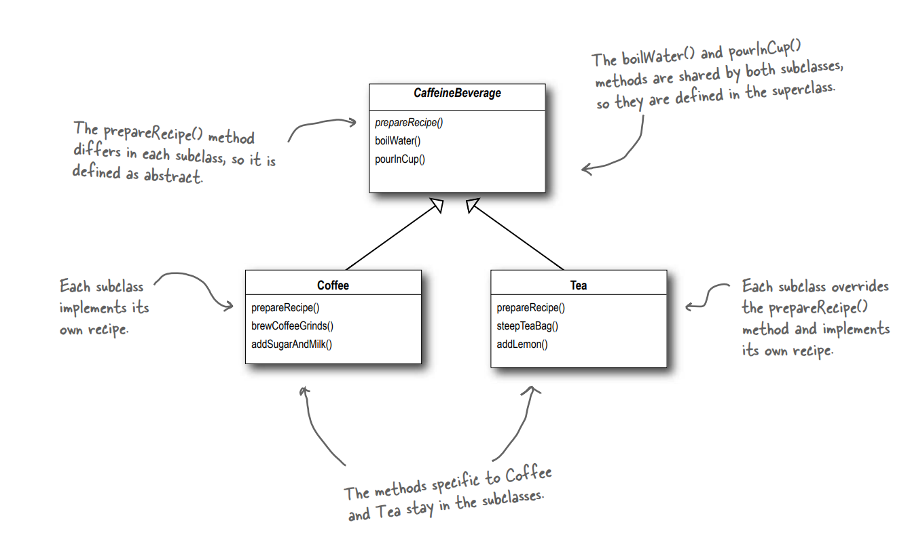

> 알고리즘의 골격을 정의한다.
> 이 패턴을 사용하면 일부 단계를 서브 클래스에서 구현할 수 있으며 알고리즘의 구조는 그대로 유지하면서 알고리즘의 특정 단계를 서브클래스에서 재정의할 수도 있다.

말 그대로 알고리즘의 템플릿을 만드는 패턴이다.

이 템플릿은 일련의 알고리즘을 일련의 단계로 정의한다.

이 단계들 중 하나 이상의 단계가 추상 메소드로 정의되어 그 추상 메소드는 서브 클래스에서 구현된다.

이렇게 되면 알고리즘의 구조는 그대로 유지하며 서브클래스가 알고리즘의 일부분의 구현을 처리할 수 있다.

[
즉, 추상클래스에 템플릿 메소드와 알고리즘의 각 단계 메소드들이 들어있고, 템플릿 메소드는 알고리즘의 구조를 책임진다.

알고리즘의 단계 메소드들 중 하나 이상이 추상 메소드로 구현되어, 서브 클래스에서 추상 메서드의 구현을 책임진다.

즉, 서브 클래스를 여러개 만들면 알고리즘의 구조는 유지한 채 특정 단계들만 알맞게 처리할 수 있다.

  
###  템플릿 메소드 패턴 예시 - 커피와 홍차

커피와 홍차는 비슷하다. 만드는 방법 또한 비슷하다.

커피 만드는 법
1. 물을 끓인다.  
2. 끓는 물에 커피를 우려낸다.  
3. 커피를 컵에 따른다.  
4. 설탕과 우유를 추가한다.

홍차 만드는 법
1. 물을 끓인다.  
2. 끓는 물에 찻잎을 우려낸다.  
3. 홍차를 컵에 따른다.  
4. 레몬을 추가한다.

전체적으로 만드는 방법이 비슷하기 때문에, 공통된 부분은 추상화한다.


아까 언급되었듯이, 커피와 홍차 제조법의 알고리즘은 똑같다.  
그렇기 때문에 _prepareRecipe()_ 메소드를 추상화할 수 있을 것이다.

일단, 물을 끓이고, 컵에 붓는 과정은 똑같다.  
커피를 우려낸다/찻잎을 우려낸다, 설탕과 우유를 추가한다/레몬을 추가한다 부분만 다른데, 또 완전 다른 건 아니다. 전자는 우리기, 후자는 첨가물 추가로 통일할 수 있다.

최종적으로 추상화된 prepareRecipe 메소드는 다음 4단계로 구성된다.
1. 물끓이기
2. 우리기 (추상 메소드)
3. 첨가물 추가 (추상 메소드)
4. 컵에 붓기

이것을 코드로 구현하면 다음과 같다.

e.g

AbstractClass `CaffeineBeverage`

```java
public abstract class CaffeineBeverage {
    // 템플릿 메소드
    // 서브 클래스에서 오버라이드를 막기 위해 final로 선언
    final void prepareRecipe() {
        boilWater();
        brew();
        pourInCup();
        addCondiments();
    }

    // 서브 클래스에서 구현해야하는 알고리즘의 단계는 abstract 메소드로 구현
    abstract void brew();

    abstract void addCondiments();

    void boilWater() {
        System.out.println("물 끓이는 중");
    }

    void pourInCup() {
        System.out.println("컵에 따르는 중");
    }
}
```

ConcreteClass `Tea`

```java
public class Tea  extends CaffeineBeverage{
    @Override
    void brew() {
        System.out.println("찻잎을 우려내는 중");
    }

    @Override
    void addCondiments() {
        System.out.println("레몬을 추가하는 중");
    }
}
```

클라이언트 입장에서의 동작

1. `tea.prepareRecipe()`
2. 추상 클래스에 구현된 템플릿 `prepareRecipe()` 메소드 호출
3. 추상 클래스에서의 추상 메소드들은 서브 클래스의 구현에 따름

  

### 템플릿 메소드 속 후크


> 💡 후크(hook)는 **추상클래스에서 선언되지만 기본적인 내용만 구현되어있거나 아무 코드도 들어있지 않은 메소드**이다.

서브클래스는 후크를 이용하여 다양한 위치에서 알고리즘에 끼어들 수도 있고, 그냥 무시하고 넘어갈 수도 있다.

customer가 첨가물 추가를 원하는 지 확인할 수 있는 훅을 추가해보자.
템플릿 메소드인 CaffeineBeverage에서는 기본적으로 true만 반환하지만, 홍차를 따를 때는 물어본다.

CaffeineBeverage 클래스에 후크를 추가한 코드는 다음과 같다.

e.g

AbstractClass with hook `CaffeineBeverageWithHook`

```java
public abstract class CaffeineBeverageWithHook {
    // 템플릿 메소드
    // 서브 클래스에서 오버라이드를 막기 위해 final로 선언
    final void prepareRecipe() {
        boilWater();
        brew();
        pourInCup();
        if (customerWantsCondiments()) {
            addCondiments();
        }
    }

    // 서브 클래스에서 구현해야하는 알고리즘의 단계는 abstract 메소드로 구현
    abstract void brew();

    abstract void addCondiments();

    void boilWater() {
        System.out.println("물 끓이는 중");
    }

    void pourInCup() {
        System.out.println("컵에 따르는 중");
    }

    // true를 반환하는 아무 작업이 없는 hook 메소드
    boolean customerWantsCondiments() {
        return true;
    }
}
```

  

ConcreteClass with hook `TeaWithHook`

```java
public class TeaWithHook extends CaffeineBeverageWithHook{
    @Override
    void brew() {
        System.out.println("찻잎을 우려내는 중");
    }

    @Override
    void addCondiments() {
        System.out.println("레몬을 추가하는 중");
    }

    @Override
    boolean customerWantsCondiments() {
        String answer = getUserInput();

        return answer.toLowerCase().startsWith("y");
    }

    private String getUserInput() {
        String answer = null;

        System.out.println("차에 레몬을 넣을까요? (y/n)");
        BufferedReader in = new BufferedReader(new InputStreamReader(System.in));

        try {
            answer = in.readLine();
        } catch (IOException e) {
            throw new RuntimeException(e);
        }

        if(answer == null) {
            return "no";
        }
        return answer;
    }
}
```

  

#### 후크의 용도

그렇다면 템플릿 메소드에서 후크는 어떤 상황에서 쓰일까?
다양한 용도로 사용되나 몇 가지 케이스로 한정하면 다음과 같다.
- 알고리즘에서 필수적이지 않은 부분을 서브클래스에서 구현하도록 만들고 싶을 때 사용하는 용도
- 팀플릿 메소드에서 앞으로 일어날 일이나 막 일어난 일에 서브클래스가 반응할 수 있도록 기회를 제공하는 용도
- 서브클래스가 추상 클래스에서 진행되는 작업을 처리할지 말지 결정하게 하는 기능을 부여하는 용도

따라서 결론은 다음과 같다.
- 서브 클래스가 알고리즘의 특정 단계를 제공해야만 한다면 추상 메소드를 사용한다.
- 알고리즘의 특정 단계가 선택적으로 적용된다면 후크를 사용한다.

```java
public abstract class CaffeineBeverage {
    
    // 템플릿 메서드: 알고리즘의 고정된 골격을 정의
    public final void prepareRecipe() {
        boilWater();
        
        // (3) 서브클래스가 brew() 수행 여부를 결정할 수 있다.
        if (shouldBrew()) {
            beforeBrew(); // (2) brew() 전에 서브클래스가 반응할 기회 제공
            brew();       // (필수 구현)
            afterBrew();  // (2) brew() 후에 서브클래스가 반응할 기회 제공
        }

        pourInCup();

        // (1) addCondiments()를 수행할지 여부를 서브클래스에 위임
        if (customerWantsCondiments()) {
            addCondiments(); // (필수 구현)
        }
    }

    // 필수 구현 단계
    protected abstract void brew();             // 추상 단계 1
    protected abstract void addCondiments();    // 추상 단계 2

    // 공통 단계
    protected void boilWater() {
        System.out.println("물 끓이는 중");
    }

    protected void pourInCup() {
        System.out.println("컵에 따르는 중");
    }

    // (1) Condiments를 넣을지 서브클래스가 선택하게 하는 hook
    protected boolean customerWantsCondiments() {
        return true; // 필수구현이 아니기 때문에 기본값은 true
    }

    // (2) brew 전 반응을 위한 hook
    protected void beforeBrew() {
        // 기본은 아무것도 안 함
    }

    // (2) brew 후 반응을 위한 hook
    protected void afterBrew() {
        // 기본은 아무것도 안 함
    }

    // (3) brew 자체를 생략할지 결정하는 hook
    protected boolean shouldBrew() {
        return true; // 기본값은 실행
    }
}

```

## 디자인 원칙 : 할리우드 원칙

> 💡 먼저 연락하지 마세요. 저희가 연락 드리겠습니다.(Don't call us, we will call you.)

할리우드 원칙을 적용하면, 저수준 구성 요소에서 고수준 구성 요소를 직접 호출할 수 없게 하고, 고수준 구성 요소가 저수준 구성 요소를 직접 호출 하는 것은 허용한다.

(할리우드에서 면접관이 “먼저 연락하지 마세요. 연락 드릴게요”라고 하는 것과 같아서 이름이 붙여졌다고 한다.)

저수준 구성 요소에서 고수준 구성 요소를 직접 호출할 수 없게 하여 **의존성 부패(dependency rot)** 를 방지할 수 있다.

  

**의존성 부패**란?

고수준 구성 요소가 저수준 구성 요소에 의존하고, 저수준 구성 요소는 고수준 구성 요소에 의존하고 그 고수준 구성 요소는 다시 또 다른 구성 요소에 의존하는 식으로 의존성이 복잡하게 꼬여있는 것을 의존성 부패라고 한다.

  

위에 템플릿 메소드 패턴을 보자.

`Abstract Class`에서 템플릿 메소드는 알고리즘을 장악하고 있고, 일부 단계에 대한 구현이 필요할 때 서브 클래스를 불러낸다. 서브 클래스들은 호출 당하기 전까지는 추상클래스를 절대 직접 호출하지 못한다.

즉, 할리우드 원칙을 잘 지킨 패턴이라고 할 수 있다.

  

## 자바 API 속 템플릿 메소드 패턴


템플릿 메소드 패턴은 프레임워크로 작업이 처리되는 방식을 제어하면서도 프레임워크에서 처리하는 알고리즘의 각 단계를 사용자가 마음대로 지정할 수 있으므로, 프레임워크를 만드는 데 아주 좋은 디자인 도구이다.

  

### 정렬

```java
public static void sort(Object[] a) {
	Object aux[] = (Object[])a.clone();
	mergeSort(aux, a, 0, a.length, 0);
}

// 템플릿 메소드
private static void mergeSort(Object src[], Object dest[],int low, int high, int off) {
	for (int i=low; i<high; i++){
		// Comparable 인터페이스를 통해 compareTo() 메소드 호출
		for (int j=i; j>low && ((Comparable)dest[j-1]).compareTo((Comparable)dest[j])>0; j--){
			swap(dest, j, j-1);
		}
	}
	return;
}
```

`Arrays`에 있는 정렬용 템플릿 메소드 `mergeSort()`에서 알고리즘을 제공하지만, 비교 방법은 `compareTo()`메소드로 구현하여야한다.

`mergeSort()` 템플릿 메소드가 불리는 과정은 다음과 같다.

1. `Arrays.sort(배열)`이 호출된다.
2. 두항목을 비교하는 `compareTo()`가 불리는데, `compareTo()`는 각 객체에 의존한다.

위에 템플릿 메소드 패턴에서처럼 서브 클래스를 사용하지 않았는데, 여기서는 모든 배열에서 `sort()`를 쓸 수 있도록 정적 메소드로 만들었다.

알고리즘의 단계는 정적 메소드인 `mergeSort()`에 구현되어있고, **정렬 알고리즘 단계 중 하나인 비교는 배열의 원소에서 구현(compareTo)** 하므로 템플릿 메소드 패턴임을 알 수 있다.

각 원소들이 `compareTo()` 메소드를 구현했는지 알기 위해 `compareTo()`만을 가지고 있는 Comparable 인터페이스를 도입하여 이 인터페이스를 구현하면 정렬을 사용할 수 있다.

  

### JFrame


```java
public class MyFrame extends JFrame {
	private static final long serialVersionUID = 2L;

	public MyFrame(String title) {
		super(title);
		this.setDefaultCloseOperation(JFrame.EXIT_ON_CLOSE);

		this.setSize(300,300);
		this.setVisible(true);
	}
	
	@Override
	public void paint(Graphics graphics) {
		super.paint(graphics);
		String msg = "I rule!!";
		graphics.drawString(msg, 100, 100);
	}

	public static void main(String[] args) {
		MyFrame myFrame = new MyFrame("Head First Design Patterns");
	}
}
```

기본적으로 `paint()`는 hook 메소드로 아무일 도 하지 않고, `paint()`를 오버라이드하여 원하는 화면을 그릴 수 있게된다.

  

### AbstractList

ArrayList, LinkedList 같은 자바의 리스트 컬렉션은 리스트에서 필요한 기능을 구현해주는 AbstractList 클래스를 확장한다.

AbstractList는 추상 메소드인 `get()`과 `size()`에 의존하는 `subList()`라는 템플릿 메소드가 있어서 `get()`과 `size()`를 구현하여야한다.

아래는 String만 들어가는 리스트를 구현한 것이다.

```java
// AbstractList provides a skeletal implementation of the List interface
// to minimize the effort required to implement this interface backed by
// a "random access" data store (such as an array).

// To implement an unmodifiable list, the programmer needs only to extend
// this class and provide implementations for the get(int) and size() methods.
// get(int index) is an abstract method in AbstractList
// size() is an abstract method in AbstractCollection
// subList(int fromIndex, int toIndex) returns a view of the portion of this list
// between the specified fromIndex, inclusive, and toIndex, exclusive.

import java.util.AbstractList;

public class MyStringList extends AbstractList<String> {
    private String[] myList;
    MyStringList(String[] strings) {
        myList = strings;
    }

    @Override
    public String get(int index) {
        return myList[index];
    }

		// set은 구현해주지 않으면 throw UnsupportedOperationException 오류를 낸다.    
		@Override
    public String set(int index, String item) {
        String oldString = myList[index];
        myList[index] = item;
        return oldString;
    }

    @Override
    public int size() {
        return myList.length;
    }
}
```


https://velog.io/@shasha/%ED%97%A4%EB%93%9C%ED%8D%BC%EC%8A%A4%ED%8A%B8-%EB%94%94%EC%9E%90%EC%9D%B8%ED%8C%A8%ED%84%B4-Chapter-08.-%ED%85%9C%ED%94%8C%EB%A6%BF-%EB%A9%94%EC%86%8C%EB%93%9C-%ED%8C%A8%ED%84%B4
https://github.com/IT-Book-Organization/HeadFirst-DesignPattern/tree/main/Chapter_08